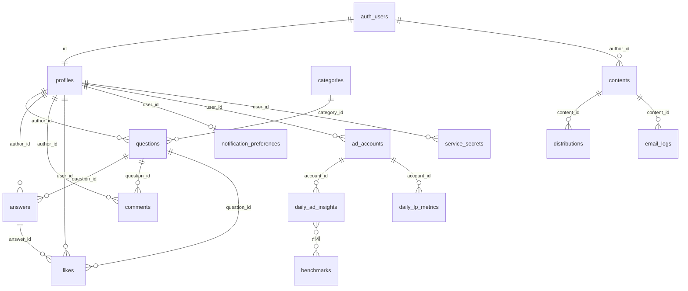
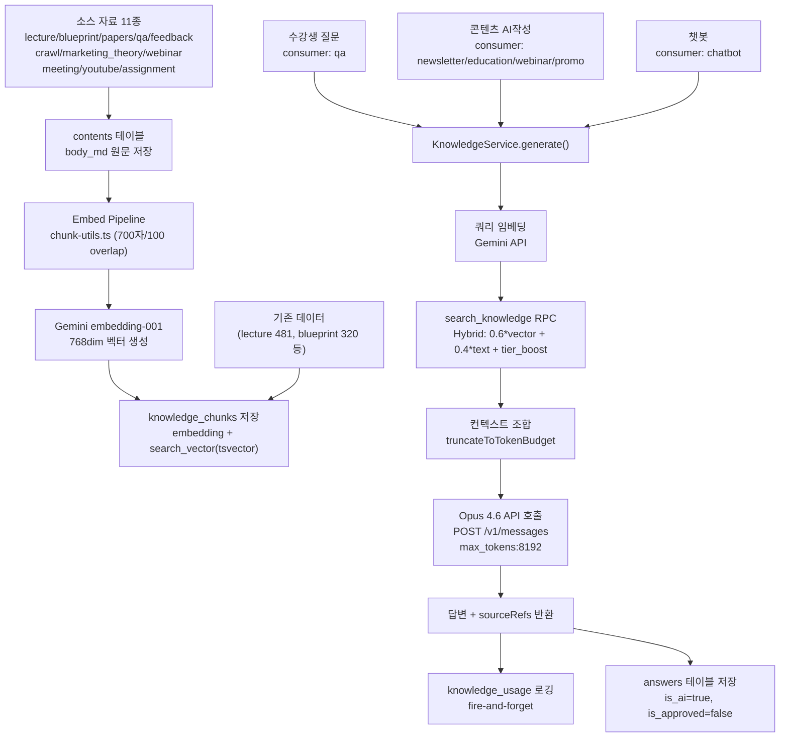
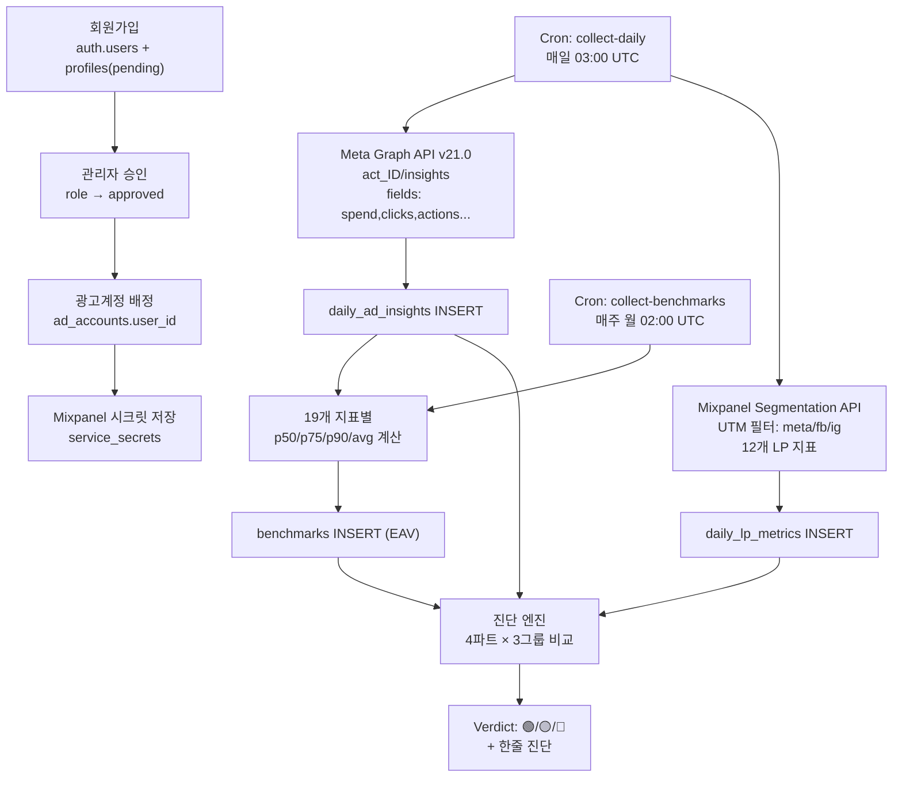
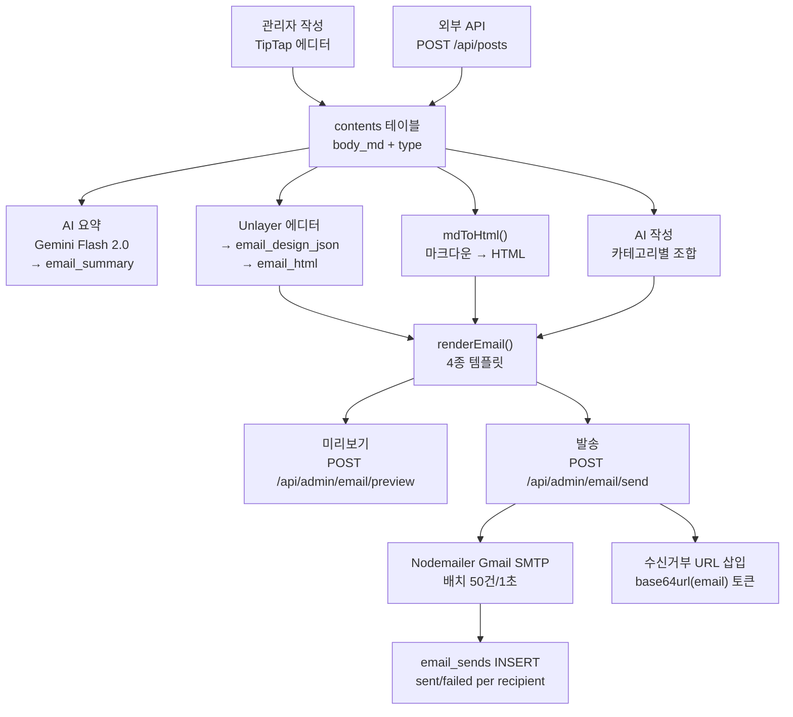
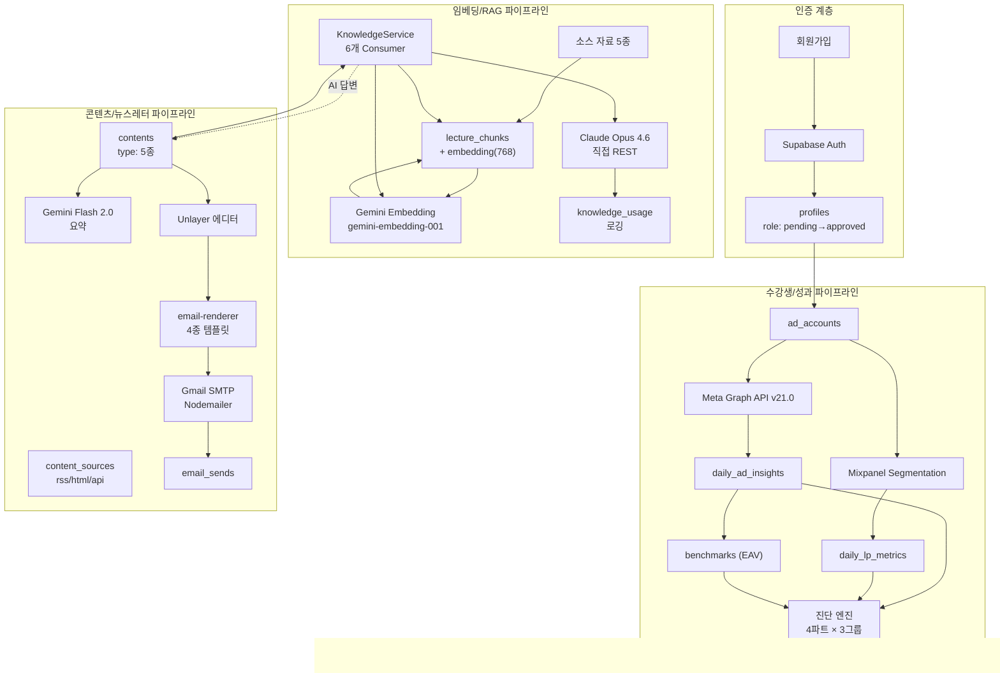

# BS CAMP QA Helpdesk — 서비스 아키텍처 보고서

> **작성일:** 2026-02-16  
> **분석 방법:** 소스 코드 직접 분석 (추측 없음). 모든 항목에 확인 파일 경로 명시.

---

## 1. 시스템 개요

### 기술 스택

| 계층 | 기술 | 버전 |
|------|------|------|
| 프레임워크 | Next.js App Router | 16.1.6 |
| 언어 | TypeScript | 5.9.3 |
| UI | React 19.2.3 + Radix UI + Tailwind CSS v4 |
| 차트 | Recharts 3.7.0 |
| 에디터 | TipTap 3.19.0 + MDXEditor 3.52.3 |
| 이메일 에디터 | Unlayer (react-email-editor) 1.7.11 |
| 이메일 발송 | Nodemailer 8.0.0 (Gmail SMTP) |
| 상태 | Zustand 5.0.11 |
| 폼 | React Hook Form 7.71.1 + Zod 4.3.6 |
| 테이블 | TanStack React Table 8.21.3 |
| 테스트 | Playwright 1.58.1 |
| DB/인증 | Supabase (PostgreSQL + Auth + Storage) 2.94.0 |
| 벡터 | pgvector VECTOR(768) |
| 배포 | Vercel Pro Plan |

> 확인: `package.json`

### 외부 서비스

| 서비스 | 용도 | API 버전 | 확인 파일 |
|--------|------|----------|-----------|
| Anthropic Claude | LLM (claude-opus-4-6) | 2023-06-01 | `src/lib/knowledge.ts` |
| Google Gemini Embedding | 임베딩 (gemini-embedding-001, 768dim) | v1beta | `src/lib/gemini.ts` |
| Google Gemini Flash | 요약 (gemini-2.0-flash) | v1beta | `api/admin/content/summarize/route.ts` |
| Meta Graph API | 광고 성과 수집 | v21.0 | `api/cron/collect-daily/route.ts` |
| Mixpanel | LP 행동 지표 (Segmentation API) | 2.0 | `api/cron/collect-daily/route.ts` |
| Gmail SMTP | 뉴스레터 발송 | — | `api/admin/email/send/route.ts` |
| 외부 Dashboard API | 판매 요약 (Cloud Run) | — | `api/sales-summary/route.ts` |

### Cron Jobs (`vercel.json`)

| 경로 | 스케줄 | KST |
|------|--------|-----|
| `/api/cron/collect-daily` | `0 3 * * *` 매일 03:00 UTC | 12:00 |
| `/api/cron/collect-benchmarks` | `0 2 * * 1` 매주 월 02:00 UTC | 11:00 |

### 환경변수

| 변수 | 용도 |
|------|------|
| `ANTHROPIC_API_KEY` | Opus 4.6 API |
| `GEMINI_API_KEY` | 임베딩 + 요약 |
| `META_ACCESS_TOKEN` | Meta Graph API |
| `CRON_SECRET` | Cron 인증 + posts API 키 |
| `SMTP_USER` / `SMTP_PASS` | Gmail SMTP |
| `NEXT_PUBLIC_BASE_URL` | 수신거부 URL 생성 |
| `NEXT_PUBLIC_SUPABASE_URL` / `ANON_KEY` | Supabase 클라이언트 |
| `SUPABASE_SERVICE_ROLE_KEY` | Supabase 서비스 클라이언트 |

---

## 2. 데이터베이스 스키마 전체

> 마이그레이션 11개 분석: `supabase/migrations/00001` ~ `00011`

### 테이블 목록

| # | 테이블 | 역할 | PK | 주요 FK |
|---|--------|------|----|----|
| 1 | profiles | 사용자 프로필 | id→auth.users | — |
| 2 | categories | 질문 카테고리 | id SERIAL | — |
| 3 | questions | 질문 | id UUID | author_id→profiles, category_id→categories |
| 4 | answers | 답변 | id UUID | question_id→questions, author_id→profiles |
| 5 | lecture_chunks | RAG 강의 청크 | id UUID | — |
| 6 | contents | 통합 콘텐츠 | id UUID | author_id→auth.users |
| 7 | distributions | 배포 기록 | id UUID | content_id→contents |
| 8 | email_logs | 이메일 이력 | id UUID | content_id→contents |
| 9 | email_sends | 개별 발송 | — | — |
| 10 | content_sources | 크롤링 대상 | id UUID | — |
| 11 | comments | 댓글 | id UUID | question_id→questions |
| 12 | likes | 좋아요 | id UUID | user_id→profiles |
| 13 | notification_preferences | 알림 | id UUID | user_id→profiles |
| 14 | ad_accounts | 광고 계정 | id UUID | user_id→profiles |
| 15 | daily_ad_insights | 일별 광고 | — | account_id (논리) |
| 16 | daily_lp_metrics | 일별 LP | — | account_id (논리) |
| 17 | benchmarks | 벤치마크 EAV | — | — |
| 18 | service_secrets | 시크릿 | — | user_id→profiles |
| 19 | knowledge_usage | AI 로그 | — | question_id, content_id |
| 20 | leads | 리드 | — | — |
| 21 | student_registry | 수강생 명부 | — | — |

### profiles (`00001`)

```
id UUID PK FK→auth.users(id)
email TEXT NOT NULL
name, phone, shop_url, shop_name, business_number TEXT NOT NULL
business_cert_url TEXT          -- Storage 이미지
cohort TEXT                     -- 수강 기수
monthly_ad_budget, category TEXT
role TEXT NOT NULL DEFAULT 'pending'
  CHECK (pending / approved / admin / rejected)
created_at, updated_at TIMESTAMPTZ (트리거 자동갱신)
```

### questions (`00001`)

```
id UUID PK, author_id FK→profiles, category_id FK→categories
title, content TEXT NOT NULL
embedding VECTOR(768)
status TEXT CHECK (open / answered / closed)
view_count, like_count INT
인덱스: author, category, status, created_at DESC
```

### answers (`00001`)

```
id UUID PK
question_id FK→questions ON DELETE CASCADE
author_id FK→profiles (NULL = AI 답변)
content TEXT NOT NULL
is_ai BOOLEAN, is_approved BOOLEAN
approved_at TIMESTAMPTZ
source_refs JSONB [{lecture_name, week, chunk_index, similarity}]
like_count INT
```

### knowledge_chunks (구 lecture_chunks → P0 `00013`에서 리네임, VIEW 하위호환)

```
id UUID PK
lecture_name, week TEXT NOT NULL
chunk_index INT NOT NULL
content TEXT NOT NULL
embedding VECTOR(768)                -- Gemini gemini-embedding-001
source_type TEXT                     -- 11종 (lecture/blueprint/papers/qa/feedback/crawl/marketing_theory/webinar/meeting/youtube/assignment)
priority INT DEFAULT 3               -- 1~5 (Tier 가중치)
content_id UUID FK → contents(id)    -- P1 Embed Pipeline 연결
chunk_total INT                      -- 해당 문서 총 chunk 수
source_ref TEXT                      -- 원본 URL/경로
topic_tags TEXT[]                    -- 주제 태그 (향후)
image_url TEXT                       -- 이미지 URL (향후)
image_description TEXT               -- 이미지 설명 (향후)
image_embedding VECTOR(768)          -- 이미지 임베딩 (향후)
search_vector TSVECTOR               -- P1 tsvector (트리거 자동 생성)
embedding_model TEXT                 -- 사용된 임베딩 모델명
metadata JSONB
인덱스: HNSW(embedding), GIN(search_vector), BTREE(source_type+priority)
```
총 1,912 chunks (2026-02-20 기준). `lecture_chunks` VIEW 유지 (하위호환).

### contents (`00004` → `00007` → `00010` → `00011`)

```
id UUID PK
title, body_md TEXT NOT NULL
summary, thumbnail_url TEXT
category TEXT (DEPRECATED — type으로 통합됨)
type TEXT NOT NULL CHECK (education/case_study/webinar/notice/promo)
tags TEXT[] (GIN 인덱스)
status TEXT DEFAULT 'draft'
source_type, source_ref, source_hash TEXT
author_id FK→auth.users
embedding VECTOR(768) (IVFFlat lists=10)
email_summary, email_subject TEXT
email_design_json JSONB, email_html TEXT  -- Unlayer
images JSONB, video_url TEXT
is_pinned BOOLEAN, view_count, like_count INT
published_at, email_sent_at TIMESTAMPTZ
ai_source TEXT
```

### ad_accounts (코드 확인: `collect-daily`, `protractor/accounts`, `admin/accounts`)

```
id UUID PK
account_id TEXT      -- Meta 광고 계정 ID
account_name TEXT
user_id FK→profiles  -- 배정된 수강생
mixpanel_project_id TEXT
active BOOLEAN
created_at TIMESTAMPTZ
```

### daily_ad_insights (`collect-daily/route.ts`)

```
date, account_id, account_name TEXT
campaign_id/name, adset_id/name, ad_id/name TEXT
spend FLOAT, impressions/reach/clicks INT
purchases INT, purchase_value FLOAT
ctr, roas FLOAT
add_to_cart, initiate_checkout INT
+ 비율 지표 13개: video_p3s_rate, thruplay_rate, retention_rate,
  reactions/comments/shares/engagement_per_10k,
  click_to_cart/checkout/purchase_rate,
  cart_to_purchase_rate, checkout_to_purchase_rate, reach_to_purchase_rate
collected_at TIMESTAMPTZ
```

### daily_lp_metrics (`collect-daily/route.ts`)

```
date, account_id, project_name TEXT
total_users INT
bounce_1s/10s_rate, avg_time_on_page FLOAT
scroll_25/50/75_rate FLOAT
review_click_rate FLOAT, total_button_clicks INT
lp_session_to_cart/checkout/purchase FLOAT
lp_checkout_to_purchase FLOAT
collected_at TIMESTAMPTZ
```

### benchmarks — EAV 패턴 (`collect-benchmarks/route.ts`)

```
date, period, metric_name TEXT
p50, p75, p90, avg_value FLOAT
sample_size INT, calculated_at TIMESTAMPTZ
-- 19개 지표 대상
```

### 기타 테이블 요약

- **distributions** (`00004`): content_id FK→contents, channel, channel_ref, rendered_title/body, status, distributed_at
- **email_logs** (`00004`): content_id FK→contents, subject, template, html_body, recipient_count, status, attachments JSONB
- **email_sends** (코드 확인): recipient_email, recipient_type (lead/student/member/custom), subject, template, status (sent/failed), error_message, sent_at
- **content_sources** (`00009`): name, url UNIQUE, feed_type CHECK (rss/html/api), crawl_frequency CHECK (daily/weekly), config JSONB
- **comments** (`00001`→`00008`): question_id NOT NULL (post_id 제거됨), author_id FK→profiles
- **likes** (`00001`→`00008`): question_id or answer_id (post_id 제거됨), UNIQUE per user
- **notification_preferences** (`00001`): user_id UNIQUE FK→profiles, email_enabled, slack_webhook_url, notify flags
- **service_secrets** (코드 확인): user_id, service, key_name, key_value — UNIQUE(user_id, service, key_name)
- **knowledge_usage** (코드 확인): consumer_type, source_types[], input/output/total_tokens, model, question_id, content_id, duration_ms
- **leads** (코드 확인): email, email_opted_out 등
- **student_registry** (코드 확인): email 등

### ER 다이어그램 (Mermaid)



### ER 다이어그램 (ASCII)

```
┌───────────┐      ┌──────────────┐      ┌──────────────┐
│auth.users │─────▶│   profiles   │─────▶│ ad_accounts  │
└───────────┘      │ role: 4종    │      │ account_id   │
      │            └──┬───┬───┬───┘      │ mixpanel_id  │
      │               │   │   │          └──────┬───────┘
      │               ▼   ▼   ▼                 │
      │          questions answers          ┌────┴────────┐    ┌────────────┐
      │          │embed768│ source_refs     │daily_ad_    │───▶│ benchmarks │
      │          └──┬─────┘                │insights     │    │  EAV p50~  │
      │             ▼                      └─────────────┘    └────────────┘
      │         comments  likes            ┌─────────────┐
      │                                    │daily_lp_    │
      ▼                                    │metrics (12) │
┌───────────┐                              └─────────────┘
│ contents  │──▶ distributions
│ type:5종  │──▶ email_logs               ┌──────────────┐
│ embed768  │                             │service_secrets│
│ email_html│                             └──────────────┘
└───────────┘   ┌──────────┐              ┌──────────────┐
                │email_    │              │knowledge_    │
┌───────────┐   │sends     │              │usage         │
│content_   │   └──────────┘              └──────────────┘
│sources    │
│rss/html   │   ┌──────────┐  ┌──────────┐  ┌──────────┐
└───────────┘   │  leads   │  │student_  │  │notif_    │
                └──────────┘  │registry  │  │prefs     │
┌───────────┐                 └──────────┘  └──────────┘
│lecture_   │
│chunks     │
│embed768   │
│source_type│
└───────────┘
```

### RLS 정책 요약 (`00002`, `00005`)

헬퍼 함수 (SECURITY DEFINER + `SET search_path = public`):
- `get_user_role()` → 현재 유저 role
- `is_approved_user()` → role IN ('approved', 'admin')
- `is_admin()` → role = 'admin'

| 테이블 | SELECT | INSERT | UPDATE | DELETE |
|--------|--------|--------|--------|--------|
| profiles | 본인+승인유저 | 본인 | 본인+admin | — |
| categories | 승인유저 | admin | admin | admin |
| questions | 승인유저 | 승인유저(본인) | 본인+admin | 본인+admin |
| answers | 승인유저 | 승인유저 | 본인+admin | 본인+admin |
| comments | 승인유저 | 승인유저(본인) | 본인 | 본인+admin |
| likes | 승인유저 | 승인유저(본인) | — | 본인 |
| lecture_chunks | 승인유저 | admin(ALL) | admin | admin |
| contents | admin(ALL) | — | — | — |
| distributions | admin(ALL) | — | — | — |
| email_logs | admin(ALL) | — | — | — |
| content_sources | admin(ALL) | — | — | — |
| notif_prefs | 본인 | 본인 | 본인 | — |

---

## 3. 데이터 흐름 상세

### 3-1. 임베딩/RAG 파이프라인

> **P0 RAG Layer 0** (2026-02-19, `8fbc017`) + **P1 Embed Pipeline + Hybrid Search** (2026-02-19, `ef889c5`)

#### knowledge_chunks 테이블 (구 lecture_chunks → P0에서 리네임)

19개 컬럼. 기존 `lecture_chunks`를 `knowledge_chunks`로 통합 마이그레이션. 하위호환 VIEW 유지.

| 주요 컬럼 | 타입 | 설명 |
|-----------|------|------|
| embedding | VECTOR(768) | Gemini 임베딩 벡터 |
| source_type | TEXT | 11종 (아래 참조) |
| priority | INT | 1~5 (Tier 가중치) |
| content_id | UUID FK | contents 테이블 연결 |
| search_vector | TSVECTOR | 텍스트 검색용 (트리거 자동 생성) |
| chunk_total | INT | 해당 문서의 총 chunk 수 |
| embedding_model | TEXT | 사용된 임베딩 모델명 |

#### source_type 11종 + 5-Tier 가중 검색

| Tier | priority | source_type | boost | 현재 chunks |
|------|----------|-------------|-------|-------------|
| T1 | 1 | lecture, blueprint, papers | +0.15 | 481 + 320 + 35 |
| T2 | 2 | qa, feedback | +0.10 | — |
| T3 | 3 | crawl, marketing_theory, webinar | +0.05 | 704 + 122 + 98 |
| T4 | 4 | meeting, youtube | 0 | 12 |
| T5 | 5 | assignment | -0.05 | — |

**총 1,912 chunks** (2026-02-20 기준)

#### 임베딩 생성 (`src/lib/gemini.ts`)

1. 텍스트 입력
2. `POST https://generativelanguage.googleapis.com/v1beta/models/gemini-embedding-001:embedContent`
3. body: `{ model: "models/gemini-embedding-001", content: { parts: [{ text }] }, outputDimensionality: 768 }`
4. 반환: `data.embedding.values` → `number[]` (768차원)
5. `knowledge_chunks.embedding` 컬럼에 VECTOR(768)로 저장

#### Embed Pipeline (`src/actions/embed-pipeline.ts`)

contents 테이블 → chunk 분할 → Gemini 임베딩 → knowledge_chunks INSERT 자동화.

1. **chunk 분할** (`src/lib/chunk-utils.ts`): 700자 기준, 100자 overlap
2. **Blueprint 특수 처리**: 기존 chunks에 content_id 연결만 (중복 INSERT 스킵)
3. **rate limit 보호**: batch 3개씩, 500ms 딜레이, 429 시 2s backoff
4. **API Route** (`/api/admin/embed`): maxDuration=300s, 서비스 키 또는 쿠키 인증
5. **Admin UI**: 개별 "임베딩 실행" + "전체 임베딩" 버튼

#### Hybrid Search RPC (`00017_hybrid_search.sql`)

```sql
search_knowledge(
  query_embedding VECTOR(768),
  match_threshold FLOAT DEFAULT 0.5,
  match_count INT DEFAULT 5,
  filter_source_types TEXT[] DEFAULT NULL,
  query_text TEXT DEFAULT NULL  -- NULL이면 vector-only (하위호환)
)
-- Hybrid scoring: 0.6 * vector_score + 0.4 * text_score + tier_boost
-- vector_score: 1 - (embedding <=> query_embedding)
-- text_score: ts_rank(search_vector, plainto_tsquery('simple', query_text))
-- tier_boost: priority 기반 가산점 (T1: +0.15 ~ T5: -0.05)
```

하위호환 래퍼: `match_lecture_chunks` (3+4 param) → `search_knowledge` 위임.

#### 인덱스

| 인덱스 | 타입 | 대상 |
|--------|------|------|
| idx_kc_embedding_hnsw | HNSW (ivfflat) | embedding, cosine |
| idx_kc_search_vector | GIN | search_vector |
| idx_kc_source_priority | BTREE | source_type, priority |
| idx_chunks_source_type | BTREE | source_type |
| idx_chunks_metadata_gin | GIN | metadata |

코드에서는 추가로 `filter_source_types` 파라미터 사용 — `knowledge.ts` `searchChunks()`.

#### KnowledgeService Consumer별 설정 (`knowledge.ts` CONSUMER_CONFIGS)

| Consumer | limit | threshold | tokenBudget | temperature | sourceTypes |
|----------|-------|-----------|-------------|-------------|-------------|
| **qa** | 5 | 0.4 | 3000 | 0.3 | lecture, qa_archive, manual |
| **newsletter** | 5 | 0.4 | 3000 | 0.5 | lecture, crawl |
| **education** | 7 | 0.5 | 5000 | 0.3 | lecture |
| **webinar** | 3 | 0.4 | 2000 | 0.6 | lecture, crawl |
| **chatbot** | 5 | 0.3 | 4000 | 0.4 | null (전체) |
| **promo** | 3 | 0.5 | 2000 | 0.7 | lecture, manual |

#### KnowledgeService.generate() 흐름 (`knowledge.ts`)

1. **쿼리 임베딩**: `generateEmbedding(query)` → Gemini API
2. **벡터 검색**: `searchChunks()` → `match_lecture_chunks` RPC (consumer config 기반 limit/threshold/sourceTypes)
3. **컨텍스트 조합**: 검색 결과를 `[lecture_name - week]\ncontent` 형식으로 합치고 `truncateToTokenBudget()` 적용
4. **사용자 메시지 구성**: `## 참고 강의 자료\n{context}\n\n## 질문\n{query}`
5. **Opus 4.6 API 호출**: `POST https://api.anthropic.com/v1/messages`
   - 모델: `claude-opus-4-6`
   - max_tokens: 8192
   - timeout: 280,000ms (Vercel Pro 300s 여유 20s)
   - 헤더: `x-api-key`, `anthropic-version: 2023-06-01`
   - 시스템 프롬프트: qa/chatbot = "자사몰사관학교 대표 Smith" 페르소나 (편한 말투, 이모지 금지, 핵심만)
6. **응답 반환**: `{ content, sourceRefs, tokensUsed, model }`
7. **로깅** (fire-and-forget): `knowledge_usage` INSERT — consumer_type, tokens, model, duration_ms

#### RAG 서비스 (`src/lib/rag.ts`) — knowledge.ts 래퍼

- `searchRelevantChunks()` → `match_lecture_chunks` RPC 직접 호출
- `generateRAGAnswer()` → `ksGenerate({ consumerType: "qa" })` 위임
- `createAIAnswerForQuestion(questionId, title, content)`:
  1. `generateRAGAnswer()` 호출
  2. `answers` 테이블 INSERT: `{ is_ai: true, is_approved: false, source_refs: [...] }`
  3. 관리자 승인 대기 상태로 저장

#### contents 벡터 검색 (`00005`)

별도로 `match_contents()` RPC 함수도 존재 — contents.embedding 대상 유사도 검색. 구조 동일.

#### 파이프라인 다이어그램 (Mermaid)



#### 파이프라인 다이어그램 (ASCII)

```
소스 자료 (11종) ──▶ contents (body_md 원문)
    │                        │
    │                  Embed Pipeline
    │              (700자 chunk, 100 overlap)
    │                        │
    ▼                        ▼
knowledge_chunks 저장 (1,912개)
    ├── embedding VECTOR(768)     ← Gemini gemini-embedding-001
    └── search_vector TSVECTOR    ← 트리거 자동 생성
    │
    ├── 수강생 질문 (qa) ──────────────────┐
    ├── 콘텐츠 AI작성 (newsletter/edu/...) ──┤
    └── 챗봇 (chatbot) ───────────────────┘
                                             │
                                             ▼
                                    KnowledgeService.generate()
                                             │
                              ┌──────────────┼──────────────┐
                              │              │              │
                              ▼              ▼              ▼
                      쿼리 임베딩     search_knowledge  Opus 4.6 호출
                      (Gemini)       RPC (Hybrid)     (280s timeout)
                                     0.6*vec+0.4*text
                                     + tier_boost
                                             │
                                             ▼
                                    답변 + sourceRefs 반환
                                             │
                                    ┌────────┴────────┐
                                    ▼                 ▼
                            knowledge_usage     answers 테이블
                            로깅 (f&f)         (is_ai=true)
```

### 3-2. 수강생/성과 파이프라인

#### 가입 → 프로필 → 승인

1. **회원가입** (`(auth)/signup`): Supabase Auth `signUp()` → `auth.users` + `profiles` INSERT (role='pending')
2. **대기** (`(auth)/pending`): role='pending' 상태
3. **관리자 승인** (`admin/members`): `profiles.role` → approved/rejected

#### 광고 계정 배정

1. **ad_accounts 등록** — 관리자가 Meta 광고 계정 생성
2. **수강생 배정** (`PUT /api/admin/accounts/assign`): `ad_accounts.user_id = userId`
3. **Mixpanel 시크릿 저장** (`POST /api/protractor/save-secret`): `service_secrets` UPSERT (key_name: `secret_{accountId}`)

#### Meta 일별 수집 (`api/cron/collect-daily/route.ts`)

```
Vercel Cron (매일 03:00 UTC)
    │
    ▼
ad_accounts WHERE active=true 조회
    │
    ├──▶ Meta Graph API v21.0
    │    GET https://graph.facebook.com/v21.0/act_{accountId}/insights
    │    access_token: META_ACCESS_TOKEN
    │    fields: spend,impressions,clicks,actions,action_values,ctr,cpc,cpm,frequency,reach
    │    date_preset: yesterday, level: ad, limit: 500
    │    timeout: 60s (AbortSignal.timeout)
    │        │
    │        ▼
    │    calculateMetrics():
    │    - actions 배열에서 add_to_cart, initiate_checkout, purchase 추출
    │    - action_values 배열에서 purchase_value 추출  
    │    - roas = purchase_value / spend
    │        │
    │        ▼
    │    daily_ad_insights INSERT (날짜별/광고별 행)
    │
    └──▶ Mixpanel Segmentation API (mixpanel_project_id 있는 계정만)
         service_secrets에서 secret 조회 (key_name: secret_{accountId})
             │
             ▼
         UTM 필터: utm_source IN (meta, facebook, fb, ig, instagram, Facebook, Instagram)
         API: https://mixpanel.com/api/2.0/segmentation
         Auth: Basic base64(secret:)
             │
             ▼
         12개 LP 지표 수집:
         - total_users: view_product 이벤트 total (Meta UTM 필터)
         - bounce_1s_rate: (total - page_exit[duration>=1]) / total * 100
         - bounce_10s_rate: (total - page_exit[duration>=10]) / total * 100
         - avg_time_on_page: page_exit의 duration 가중평균
         - scroll_25/50/75_rate: scroll_depth[scroll_percent>=N] / total * 100
         - review_click_rate: review_click / total * 100
         - total_button_clicks: $mp_click total
         - lp_session_to_cart: unique add_to_cart / total * 100
         - lp_session_to_checkout: unique begin_checkout / total * 100
         - lp_session_to_purchase: unique purchase / total * 100
         - lp_checkout_to_purchase: unique purchase / unique begin_checkout * 100
             │
             ▼
         최소 기준: totalSessions < 10이면 스킵
             │
             ▼
         daily_lp_metrics INSERT
```

#### 주간 벤치마크 계산 (`api/cron/collect-benchmarks/route.ts`)

```
Vercel Cron (매주 월 02:00 UTC)
    │
    ▼
daily_ad_insights WHERE date >= 7일 전 조회
    │
    ▼
19개 지표별:
  - 양수 값만 필터 → 정렬
  - percentile(sorted, p): 선형 보간
  - p50, p75, p90, avg 계산
  - sample_size 기록
    │
    ▼
benchmarks INSERT (EAV: metric_name별 1행)

벤치마크 19개 지표:
roas, ctr, spend, impressions, clicks, purchases, purchase_value,
video_p3s_rate, thruplay_rate, retention_rate,
reactions/comments/shares/engagement_per_10k,
click_to_cart/checkout/purchase_rate,
checkout_to_purchase_rate, reach_to_purchase_rate
```

#### 진단 엔진 (`src/lib/diagnosis/`)

**파일 구조:**
- `types.ts` — Verdict(GOOD🟢/NORMAL🟡/POOR🔴/UNKNOWN⚪), MetricResult, PartResult, DiagnosisResult
- `metrics.ts` — 4개 파트 × 지표 정의 (PART_METRICS)
- `engine.ts` — 핵심 진단 로직 (judgeMetric, judgePart, diagnoseAd)
- `one-line.ts` — 한줄 진단 생성 (우선순위 기반)
- `index.ts` — re-export

**4개 파트 (`metrics.ts`):**

| 파트 | 이름 | benchmarkSource | 지표 수 | 주요 지표 |
|------|------|-----------------|---------|-----------|
| 0 | 기반점수 | engagement | 3 | video_p3s_rate, thruplay_rate, retention_rate |
| 1 | LP품질 | quality | 10 | lcp↓, fcp↓, bounce_1s/10s_rate↓, avg_time, scroll_25/50/75, review_click, total_button_clicks |
| 2 | 참여율 | engagement | 4 | reactions/comments/shares/engagement_per_10k |
| 3 | 전환율 | conversion | 10 | ctr, click_to_cart/checkout/purchase, cart_to_purchase, checkout_to_purchase + LP 세션 기반 4개 |

(↓ = 역방향: 낮을수록 좋음)

**판정 로직 (`engine.ts` V3: 3그룹 비교):**

1. `judgeMetric(myValue, aboveAvg, averageAvg)`:
   - 정방향: ≥above → GOOD, ≥average → NORMAL, else → POOR
   - 역방향(isReverse): ≤above → GOOD, ≤average → NORMAL, else → POOR
2. `judgePart(metricResults)`: 하나라도 POOR → 파트 POOR, 전부 GOOD → 파트 GOOD, else → NORMAL
3. 전체 판정: 하나라도 POOR → POOR, 전부 GOOD → GOOD, else → NORMAL
4. Meta 랭킹 UNKNOWN 시 `selfJudgeRanking()`: 대표 지표로 3그룹 거리 비교 → 다수결 분류

**V3.4 creative_type 분기:**
- `VIDEO`: 파트0→1→2→3 순서로 우선순위 진단
- `SHARE`: 파트0 스킵 (UNKNOWN), 파트1→2→3

**한줄 진단 (`one-line.ts`):**
- 파트0🔴: "영상을 먼저 바꿔야 해요. 3초 훅이 약해요."
- 파트0🟢/🟡 + 파트1🔴: "영상은 좋은데 LP에서 다 빠져나가요."
- 전부🟢/🟡 + 파트2🔴: "광고가 눈에 안 띄어요. 반응을 이끌어내는 후킹 요소가 필요해요."
- 전부🟢/🟡 + 파트3🔴: "관심은 있는데 안 사요. 제품/가격/혜택을 점검하세요."
- 전부🟢: "잘 하고 있어요! 예산 늘려보세요."
- 전부🟡 섞임: "전반적으로 괜찮아요. 🟡인 부분을 개선하면 더 좋아질 거예요."

**벤치마크 EAV → 9그룹 변환 (`diagnose/route.ts` transformBenchmarks):**
```
EAV { metric_name, avg_value, p75 }
  → {ranking_type}_above:   p75 값 (상위 기준선)
  → {ranking_type}_average: avg_value
  → {ranking_type}_below:   avg_value * 0.5 (추정)
  × 3 ranking_type (quality, engagement, conversion)
  = 9개 그룹 객체
```

#### 수강생/성과 파이프라인 다이어그램 (Mermaid)



### 3-3. 콘텐츠/뉴스레터 파이프라인

#### 콘텐츠 생성 경로

1. **관리자 직접 작성** (`admin/content/[id]`): TipTap 에디터로 body_md 작성, type 5종 선택
2. **외부 시스템 API** (`POST /api/posts`): CRON_SECRET 인증, contents 테이블에 draft 상태로 생성
3. **AI 요약** (`POST /api/admin/content/summarize`): Gemini Flash 2.0으로 body_md → email_summary 생성
   - 프롬프트: "훅 질문 1줄 + 핵심 포인트 3개 불릿 + ~해요 말투 + 200자 내외"
4. **AI 작성** (`POST /api/admin/email/ai-write`): DB에서 카테고리별 콘텐츠 조회 → 뉴스레터 HTML 조합

#### 뉴스레터 발송 흐름

1. **이메일 디자인** (`admin/email/[id]`):
   - Unlayer 에디터로 비주얼 디자인 → `email_design_json` JSONB + `email_html` TEXT 저장
   - 또는 마크다운 → `mdToHtml()` 변환 (`src/lib/markdown.ts`)
   - `PATCH /api/admin/content/[id]/newsletter`: email_design_json, email_html, email_subject 저장

2. **미리보기** (`POST /api/admin/email/preview`):
   - `renderEmail(template, props)` → 4종 템플릿: newsletter, webinar, performance, promo
   - Pretendard 웹폰트 + 자사몰사관학교 브랜딩 (#F75D5D, #E85A2A)
   - 수신거부 링크 placeholder `{{UNSUBSCRIBE_URL}}`

3. **수신자 조회** (`GET /api/admin/email/recipients`): `getRecipientStats()` 서버 액션

4. **발송** (`POST /api/admin/email/send`):
   - 수신 대상 5종: all, all_leads, all_students, all_members, custom
   - leads (email_opted_out=false) + profiles (member/student/alumni/admin) 통합, 중복 제거
   - Nodemailer + Gmail SMTP (smtp.gmail.com:587)
   - 배치 발송: 50건씩 / 1초 딜레이
   - 수신자별 수신거부 URL 삽입: `base64url(email)` 토큰
   - `email_sends` INSERT per recipient (sent/failed + error_message)
   - 첨부파일 지원 (Supabase Storage URL)

5. **첨부파일 업로드** (`POST /api/admin/email/upload`):
   - 최대 10MB, MIME 타입 검증 (pdf, jpeg, png, gif, doc, csv, xlsx)
   - Supabase Storage `email-attachments` 버킷

#### 마크다운 → HTML 변환 (`src/lib/markdown.ts`)

`mdToHtml()`: h1~h3, ul/ol, p 지원 + 인라인 포맷팅 (bold, italic, code)

#### 이메일 템플릿 4종 (`src/lib/email-templates.ts`)

| 템플릿 | 용도 | 주요 Props |
|--------|------|-----------|
| newsletter | 뉴스레터 | subject, bodyHtml, ctaText/Url |
| webinar | 웨비나 초대 | title, date, time, registrationUrl |
| performance | 성과 리포트 | roas, revenue, adSpend, bodyText |
| promo | 프로모션 | headline, bodyText, benefits[], deadline |

공통: Pretendard 폰트, 수신거부 링크, 자사몰사관학교 브랜딩

#### 콘텐츠 파이프라인 다이어그램 (Mermaid)



### 3-4. 인증/권한

#### 인증 흐름

1. **Supabase Auth**: 이메일+비밀번호 기반
2. **프로필 생성**: 가입 시 `profiles` INSERT (role='pending')
3. **역할 체계**: pending → approved/admin/rejected

#### 권한 분류

| role | Q&A | 콘텐츠 | 총가치각도기 | 관리자 기능 |
|------|-----|--------|-------------|------------|
| pending | ✗ | ✗ | ✗ | ✗ |
| approved | ✓ | 열람 | ✗ | ✗ |
| student/alumni | ✓ | 열람 | ✓ (본인 계정) | ✗ |
| admin | ✓ | CRUD | ✓ (전체) | ✓ |

> `student`, `alumni` role은 코드에서 확인됨 (`_shared.ts` ALLOWED_ROLES, `email/send` 수신자 조회)  
> 마이그레이션의 profiles CHECK에는 pending/approved/admin/rejected만 정의  
> → 코드와 DB CHECK 불일치 가능성 있음

#### API 인증 패턴

- **사용자 인증**: `createClient()` → `supabase.auth.getUser()` — Supabase 쿠키 기반
- **Admin 확인**: `createServiceClient()` → `profiles.role = 'admin'` 체크
- **Protractor 접근**: `requireProtractorAccess()` — role IN ('student', 'alumni', 'admin') + 계정 소유권 확인
- **Cron 인증**: `authorization: Bearer {CRON_SECRET}` 헤더
- **Posts API**: CRON_SECRET을 API 키로 사용

---

## 4. API 라우트 전체 맵

총 22개 라우트 (route.ts 파일 기준).

### Cron 라우트 (2개)

| # | 경로 | 메서드 | 인증 | 입력 | 출력 | 의존 테이블 |
|---|------|--------|------|------|------|------------|
| 1 | `/api/cron/collect-daily` | POST | CRON_SECRET | — | 계정별 수집 결과 | ad_accounts, daily_ad_insights, daily_lp_metrics, service_secrets |
| 2 | `/api/cron/collect-benchmarks` | POST | CRON_SECRET | — | 벤치마크 계산 결과 | daily_ad_insights, benchmarks |

### Admin 라우트 (9개)

| # | 경로 | 메서드 | 입력 | 출력 | 의존 테이블 |
|---|------|--------|------|------|------------|
| 3 | `/api/admin/accounts` | GET | — | accounts + students 목록 | ad_accounts, profiles |
| 4 | `/api/admin/accounts/assign` | PUT | accountId, userId | success | ad_accounts |
| 5 | `/api/admin/content/summarize` | POST | content_id | summary 텍스트 | contents |
| 6 | `/api/admin/content/[id]/newsletter` | PATCH | email_design_json, email_html, email_subject | success | contents |
| 7 | `/api/admin/email/ai-write` | POST | category, topic, tone | subject, content HTML, sources | contents |
| 8 | `/api/admin/email/preview` | POST | template, subject, templateProps | HTML 문자열 | — |
| 9 | `/api/admin/email/recipients` | GET | — | 수신자 통계 | profiles, leads, student_registry |
| 10 | `/api/admin/email/send` | POST | target, subject, html/template | sent/failed 카운트 | profiles, leads, student_registry, email_sends |
| 11 | `/api/admin/email/upload` | POST | file (multipart) | url, filename, size | Supabase Storage |
| 12 | `/api/admin/protractor/status` | GET | — | 계정별 수집 상태 | ad_accounts, daily_ad_insights, daily_lp_metrics, service_secrets |

### Protractor 라우트 (5개) — student/alumni/admin

| # | 경로 | 메서드 | 입력 | 출력 | 의존 테이블 |
|---|------|--------|------|------|------------|
| 13 | `/api/protractor/accounts` | GET | — | 본인 계정 목록 | ad_accounts |
| 14 | `/api/protractor/insights` | GET | account_id, start, end | daily_ad_insights 데이터 | daily_ad_insights |
| 15 | `/api/protractor/lp-metrics` | GET | account_id, start, end | daily_lp_metrics 데이터 | daily_lp_metrics |
| 16 | `/api/protractor/benchmarks` | GET | — | 최신 벤치마크 (wide format) | benchmarks |
| 17 | `/api/protractor/save-secret` | POST | metaAccountId, mixpanelSecret | ok | service_secrets |

### 진단 라우트 (1개)

| # | 경로 | 메서드 | 입력 | 출력 | 의존 테이블 |
|---|------|--------|------|------|------------|
| 18 | `/api/diagnose` | POST | accountId, startDate, endDate, limit | 광고별 진단 결과 배열 | daily_ad_insights, benchmarks |

### Public/기타 라우트 (4개)

| # | 경로 | 메서드 | 인증 | 설명 | 의존 테이블 |
|---|------|--------|------|------|------------|
| 19 | `/api/posts` | GET | — | 공개 콘텐츠 목록 | contents |
| 20 | `/api/posts` | POST | CRON_SECRET | 외부 콘텐츠 생성 | contents |
| 21 | `/api/notifications` | POST | User | 알림 전송 (TODO) | — |
| 22 | `/api/sales-summary` | GET | User | 외부 API 프록시 | — |
| 23 | `/api/verify-business` | POST | — | 사업자등록번호 형식 검증 (TODO) | — |

> **참고:** 실제 route.ts 파일은 22개이나, `/api/posts`가 GET+POST 두 메서드를 포함하여 실질 23개 엔드포인트.

---

## 5. 컴포넌트/페이지 구조

### App Router 구조

```
src/app/
├── layout.tsx                    -- 루트 레이아웃
├── page.tsx                      -- 랜딩 페이지
│
├── (auth)/                       -- 인증 그룹
│   ├── login/page.tsx
│   ├── signup/page.tsx
│   ├── pending/page.tsx          -- 승인 대기
│   ├── subscribe/page.tsx        -- 구독 신청
│   └── unsubscribe/page.tsx      -- 수신거부
│
├── (main)/                       -- 메인 앱 그룹
│   ├── layout.tsx                -- 사이드바/네비게이션
│   │
│   ├── dashboard/page.tsx        -- 대시보드
│   │
│   ├── questions/                -- Q&A
│   │   ├── page.tsx              -- 질문 목록
│   │   ├── new/page.tsx          -- 질문 작성
│   │   └── [id]/page.tsx         -- 질문 상세 + 답변
│   │
│   ├── posts/                    -- 정보공유
│   │   ├── page.tsx              -- 목록
│   │   ├── new/page.tsx          -- 작성
│   │   └── [id]/page.tsx         -- 상세
│   │
│   ├── notices/                  -- 공지사항
│   │   ├── page.tsx              -- 목록
│   │   └── [id]/page.tsx         -- 상세
│   │
│   ├── protractor/               -- 총가치각도기
│   │   ├── layout.tsx            -- 각도기 레이아웃
│   │   └── page.tsx              -- 대시보드 (차트, 퍼널, 진단)
│   │
│   ├── settings/page.tsx         -- 설정
│   │
│   └── admin/                    -- 관리자 영역
│       ├── layout.tsx            -- 관리자 레이아웃
│       ├── members/page.tsx      -- 회원 관리 (승인/거절)
│       ├── answers/page.tsx      -- AI 답변 승인 관리
│       ├── accounts/page.tsx     -- 광고 계정 관리 + 배정
│       ├── content/              -- 콘텐츠 관리
│       │   ├── page.tsx          -- 콘텐츠 목록
│       │   └── [id]/page.tsx     -- 콘텐츠 편집 (TipTap)
│       ├── email/                -- 이메일 관리
│       │   ├── page.tsx          -- 이메일 목록
│       │   └── [id]/page.tsx     -- 이메일 편집 (Unlayer)
│       ├── protractor/page.tsx   -- 총가치각도기 관리 (수집 상태)
│       └── stats/page.tsx        -- 통계
│
└── api/                          -- API 라우트 (섹션 4 참조)
```

### 주요 컴포넌트 영역

| 영역 | 페이지 | 핵심 기능 |
|------|--------|----------|
| Q&A | questions/* | 질문 CRUD + AI 답변 자동 생성 + 카테고리 필터 |
| 정보공유 | posts/* | 콘텐츠 열람 (contents 테이블) |
| 공지 | notices/* | 공지사항 열람 (contents type=notice) |
| 총가치각도기 | protractor/* | 광고 성과 대시보드 + 진단 + LP 지표 + 벤치마크 비교 |
| 관리자 | admin/* | 회원/답변/계정/콘텐츠/이메일/각도기 관리 |
| 인증 | (auth)/* | 로그인/가입/대기/구독/수신거부 |

### 총가치각도기 집계 유틸 (`src/lib/protractor/aggregate.ts`)

| 함수 | 용도 |
|------|------|
| `aggregateSummary()` | 총매출/광고비/ROAS/CPC/CTR 집계 |
| `toSummaryCards()` | 전주 대비 변화율 포함 6개 카드 |
| `getTop5Ads()` | ad_id별 그루핑 → spend DESC TOP 5 |
| `toDailyTrend()` | 일별 매출/광고비 차트 데이터 |
| `toFunnelData()` | 노출→클릭→장바구니(추정)→구매 퍼널 |
| `toDailyMetrics()` | 일별 성과 테이블 |
| `splitPreviousPeriod()` | 현재/이전 기간 분리 |

---

## 6. 외부 연동 상세

### 6-1. Meta Graph API

> 확인: `src/app/api/cron/collect-daily/route.ts`

| 항목 | 값 |
|------|---|
| **엔드포인트** | `https://graph.facebook.com/v21.0/act_{accountId}/insights` |
| **인증** | `access_token` 쿼리 파라미터 (META_ACCESS_TOKEN 환경변수) |
| **요청 필드** | spend, impressions, clicks, actions, action_values, ctr, cpc, cpm, frequency, reach |
| **날짜 범위** | `date_preset: yesterday` |
| **집계 레벨** | `level: ad` |
| **페이지네이션** | `limit: 500` (단일 페이지) |
| **타임아웃** | 60초 (`AbortSignal.timeout(60_000)`) |
| **에러 처리** | `data.error` 존재 시 throw, 에러 메시지 포함 |
| **action 추출** | `add_to_cart`, `omni_add_to_cart`, `initiate_checkout`, `omni_initiated_checkout`, `purchase`, `omni_purchase` |
| **value 추출** | `purchase`, `omni_purchase` (action_values) |

**한계:**
- 단일 `META_ACCESS_TOKEN` 사용 (모든 계정 공유) — 토큰 만료 시 전체 실패
- 페이지네이션 미구현 (500건 제한) — 광고 수가 500개 초과 시 누락 가능
- `yesterday` 고정 — 과거 데이터 재수집 불가

### 6-2. Mixpanel Segmentation API

> 확인: `src/app/api/cron/collect-daily/route.ts`

| 항목 | 값 |
|------|---|
| **엔드포인트** | `https://mixpanel.com/api/2.0/segmentation` |
| **인증** | `Basic base64(secret:)` 헤더 (service_secrets 테이블에서 조회) |
| **UTM 필터** | `utm_source IN (meta, facebook, fb, ig, instagram, Facebook, Instagram)` |
| **이벤트 유형** | view_product, page_exit, scroll_depth, review_click, $mp_click, add_to_cart, begin_checkout, purchase |
| **쿼리 타입** | `general` (총 이벤트 수), `unique` (고유 사용자 수) |
| **기간** | from_date ~ to_date (어제~어제) |
| **특수 처리** | duration 가중평균: page_exit의 duration 속성별 이벤트 수로 가중 |

**시크릿 저장 경로:**
- `service_secrets` WHERE service='mixpanel' AND key_name=`secret_{accountId}`
- 사용자가 `POST /api/protractor/save-secret`으로 직접 등록

### 6-3. Anthropic Claude (Opus 4.6)

> 확인: `src/lib/knowledge.ts`

| 항목 | 값 |
|------|---|
| **엔드포인트** | `https://api.anthropic.com/v1/messages` |
| **모델** | `claude-opus-4-6` |
| **인증** | `x-api-key` 헤더 (ANTHROPIC_API_KEY) |
| **API 버전** | `anthropic-version: 2023-06-01` |
| **max_tokens** | 8192 |
| **타임아웃** | 280,000ms (AbortController) |
| **에러 처리** | 401/403 → "접근 권한 없음", AbortError → "시간 초과", 기타 HTTP 에러 → 상태코드+본문 |
| **호출 방식** | 직접 REST 호출 (SDK 미사용) |

**시스템 프롬프트 (qa/chatbot):**
- 페르소나: "자사몰사관학교 대표 Smith"
- 편한 말투, AI식 인사/마무리 금지, 이모지 금지
- 핵심만 짧게, 모르면 "다룬 내용이 아니라서" 한 줄로 종료
- 강의 내용이면 "강의에서도 말씀드렸지만" 자연스러운 연결

### 6-4. Google Gemini

> 확인: `src/lib/gemini.ts`, `api/admin/content/summarize/route.ts`

#### 임베딩 (gemini.ts)

| 항목 | 값 |
|------|---|
| **모델** | `gemini-embedding-001` |
| **엔드포인트** | `https://generativelanguage.googleapis.com/v1beta/models/gemini-embedding-001:embedContent` |
| **인증** | `key` 쿼리 파라미터 (GEMINI_API_KEY) |
| **출력 차원** | 768 (`outputDimensionality: 768`) |
| **입력** | `{ content: { parts: [{ text }] } }` |
| **출력** | `data.embedding.values` → number[] |

#### 요약 (summarize/route.ts)

| 항목 | 값 |
|------|---|
| **모델** | `gemini-2.0-flash` |
| **엔드포인트** | `https://generativelanguage.googleapis.com/v1beta/models/gemini-2.0-flash:generateContent` |
| **temperature** | 0.7 |
| **maxOutputTokens** | 1024 |
| **용도** | 콘텐츠 body_md → 이메일용 요약 생성 |
| **maxDuration** | 300 (Vercel Pro) |

### 6-5. 외부 Dashboard API

> 확인: `src/app/api/sales-summary/route.ts`

| 항목 | 값 |
|------|---|
| **URL** | `https://dashboard-api-906295665279.asia-northeast3.run.app/sales-summary` |
| **인증** | 없음 (서버→서버 프록시) |
| **캐시** | `next: { revalidate: 300 }` (5분) |

---

## 7. 전체 데이터 흐름 다이어그램

### 전체 시스템 (Mermaid)



### 전체 시스템 (ASCII)

```
╔══════════════════════════════════════════════════════════════════╗
║                    BS CAMP QA Helpdesk                          ║
║                    Next.js 16 + Vercel Pro                      ║
╠══════════════════════════════════════════════════════════════════╣
║                                                                  ║
║  ┌─────────────────────────────────────────────────────────┐    ║
║  │                    인증 계층                              │    ║
║  │  Supabase Auth → profiles (role: 4종) → ad_accounts     │    ║
║  └───────────────────────────┬─────────────────────────────┘    ║
║                              │                                   ║
║  ┌───────────────────────────┼──────────────────────────────┐   ║
║  │              임베딩/RAG 파이프라인                          │   ║
║  │                                                           │   ║
║  │  소스 5종 → lecture_chunks → Gemini Embedding (768dim)    │   ║
║  │                    ↓                                      │   ║
║  │  수강생 질문 ──→ KnowledgeService ──→ Opus 4.6            │   ║
║  │  콘텐츠 AI  ──→ (6 Consumer)    ──→ (REST 직접)           │   ║
║  │  챗봇      ──→     │            ──→ answers 저장          │   ║
║  │                    ↓                                      │   ║
║  │              knowledge_usage 로깅                          │   ║
║  └───────────────────────────────────────────────────────────┘   ║
║                                                                   ║
║  ┌───────────────────────────────────────────────────────────┐   ║
║  │             수강생/성과 파이프라인                           │   ║
║  │                                                           │   ║
║  │  [매일 03:00 UTC]                                         │   ║
║  │  ad_accounts ──→ Meta Graph API v21.0 ──→ daily_ad_insights│  ║
║  │              ──→ Mixpanel Segmentation ──→ daily_lp_metrics │  ║
║  │                                                           │   ║
║  │  [매주 월 02:00 UTC]                                      │   ║
║  │  daily_ad_insights ──→ p50/p75/p90/avg ──→ benchmarks     │   ║
║  │                                                           │   ║
║  │  daily_ad_insights + daily_lp_metrics + benchmarks        │   ║
║  │       ──→ 진단 엔진 (4파트 × 3그룹) ──→ 🟢🟡🔴 + 한줄   │   ║
║  └───────────────────────────────────────────────────────────┘   ║
║                                                                   ║
║  ┌───────────────────────────────────────────────────────────┐   ║
║  │            콘텐츠/뉴스레터 파이프라인                        │   ║
║  │                                                           │   ║
║  │  관리자 작성 / 외부 API → contents (body_md + type 5종)   │   ║
║  │       ↓                         ↓                        │   ║
║  │  Gemini Flash 요약         Unlayer 에디터                 │   ║
║  │  (email_summary)           (email_design_json)            │   ║
║  │       ↓                         ↓                        │   ║
║  │  email-renderer (4종 템플릿: newsletter/webinar/perf/promo)│  ║
║  │       ↓                                                   │   ║
║  │  Gmail SMTP (배치 50건/1초) → email_sends (sent/failed)   │   ║
║  │  수신자: leads + profiles + student_registry              │   ║
║  └───────────────────────────────────────────────────────────┘   ║
║                                                                   ║
║  ┌──────────────────────────────────────────┐                    ║
║  │  연결되지 않은 테이블/기능                   │                    ║
║  │  - content_sources (크롤러 미구현)          │                    ║
║  │  - distributions (배포 로직 미구현)          │                    ║
║  │  - notifications API (TODO)               │                    ║
║  │  - verify-business (국세청 API TODO)       │                    ║
║  └──────────────────────────────────────────┘                    ║
╚══════════════════════════════════════════════════════════════════╝
```

### 파이프라인 간 연결 관계

```
임베딩/RAG ←──── lecture_chunks ────→ (독립적 데이터 소스)
     │
     ├── 수강생 질문 → answers 테이블
     └── 콘텐츠 AI 작성 → contents 테이블
                              │
                              └──→ 뉴스레터 파이프라인

수강생/성과 ←── ad_accounts ──→ profiles
     │
     ├── daily_ad_insights ──→ 총가치각도기 대시보드
     ├── daily_lp_metrics ───→ LP품질 진단
     └── benchmarks ─────────→ 3그룹 비교 진단

콘텐츠/뉴스레터 ←── contents ──→ (RAG에서 AI 작성 가능)
     │
     └── email_sends ──→ leads + profiles + student_registry
```

---

## 8. 현재 한계 / 미연결 포인트

### 8-1. 끊어진 데이터 연결

| # | 항목 | 현황 | 확인 파일 |
|---|------|------|-----------|
| 1 | **content_sources 테이블** | 테이블 존재하나 실제 크롤러 구현 없음. feed_type (rss/html/api) 정의만 있음. | `00009_content_sources.sql` — 크롤링 로직 route.ts 미발견 |
| 2 | **distributions 테이블** | 테이블 존재하나 INSERT하는 코드 없음. email_sends가 실질적 발송 기록 역할. | `00004_content_hub.sql` — 코드에서 distributions 사용 안 됨 |
| 3 | **notifications API** | `POST /api/notifications` — "TODO: 이메일/슬랙 알림 구현" 주석만 존재 | `api/notifications/route.ts` |
| 4 | **verify-business API** | 사업자등록번호 형식 검증만 수행. 국세청 API 미연동. | `api/verify-business/route.ts` |
| 5 | **notification_preferences** | 테이블 존재, slack_webhook_url 컬럼 있으나 실제 알림 발송 미구현 | `00001_initial_schema.sql` |

### 8-2. DB 스키마/코드 불일치

| # | 항목 | 상세 |
|---|------|------|
| 1 | **profiles.role CHECK** | 마이그레이션: `pending/approved/admin/rejected` 4종. 코드: `student`, `alumni`, `member` role도 사용 (`_shared.ts`, `email/send`). CHECK 제약 불일치. |
| 2 | **lecture_chunks 확장 컬럼** | `source_type`, `metadata` 컬럼이 코드(`knowledge.ts` ChunkResult)에서 사용되나 마이그레이션 파일에 ALTER TABLE 없음. 별도로 추가된 것으로 추정. |
| 3 | **match_lecture_chunks filter_source_types** | 코드에서 `filter_source_types` 파라미터 전달하나 `00003`의 RPC 함수에는 해당 파라미터 없음. RPC 함수가 업데이트된 것으로 추정. |
| 4 | **contents 확장 컬럼** | `email_design_json`, `email_html`이 `newsletter/route.ts`에서 사용되나 마이그레이션에 명시적 ALTER 없음. |

### 8-3. 잠재적 개선 포인트

| # | 영역 | 현황 | 개선 방향 |
|---|------|------|----------|
| 1 | **Meta 토큰 관리** | 단일 `META_ACCESS_TOKEN` 전역 사용 | 계정별 토큰 관리 또는 System User 토큰 도입 |
| 2 | **Meta 페이지네이션** | `limit: 500` 단일 페이지 | 커서 기반 페이지네이션 구현 (광고 500개 초과 대응) |
| 3 | **Meta 날짜 유연성** | `date_preset: yesterday` 고정 | 날짜 범위 파라미터화 (재수집 기능) |
| 4 | **크롤러 구현** | `content_sources` 테이블만 존재 | RSS/HTML 크롤러 Cron Job 구현 → lecture_chunks에 crawl 타입으로 저장 |
| 5 | **distributions 활용** | 미사용 | 뉴스레터 발송 시 distributions에 기록, 다채널 배포 추적 |
| 6 | **LP 데이터 진단 연결** | `diagnoseAd()`에서 `lpData = null` 전달 | daily_lp_metrics 조인하여 파트1(LP품질) 실제 데이터 연결 |
| 7 | **벤치마크 세분화** | 전체 데이터 단일 벤치마크 | 카테고리별/예산대별 벤치마크 그룹화 |
| 8 | **email_logs 활용** | 테이블 존재하나 email_sends가 주로 사용됨 | email_logs에 발송 집계 기록, 열람/클릭 추적 연동 |
| 9 | **IVFFlat 인덱스** | lecture_chunks에 벡터 인덱스 주석 처리됨 | 데이터 충분 시 활성화 (HNSW 고려) |
| 10 | **Opus 타임아웃** | 280s (Vercel 300s 한도) | 스트리밍 응답 도입으로 UX 개선 |

### 8-4. 보안 관련

| # | 항목 | 상세 |
|---|------|------|
| 1 | **CRON_SECRET 이중 사용** | Vercel Cron 인증과 posts API 키를 동일 시크릿으로 사용 | 
| 2 | **서비스 시크릿 평문 저장** | Mixpanel secret이 `service_secrets.key_value`에 평문 저장 |
| 3 | **수신거부 토큰** | `base64url(email)` — 추측 가능. HMAC 서명 추가 권장 |
| 4 | **contents RLS** | `is_admin()` ALL — 승인 유저의 contents 읽기 불가 (service_role 클라이언트 필요) |
