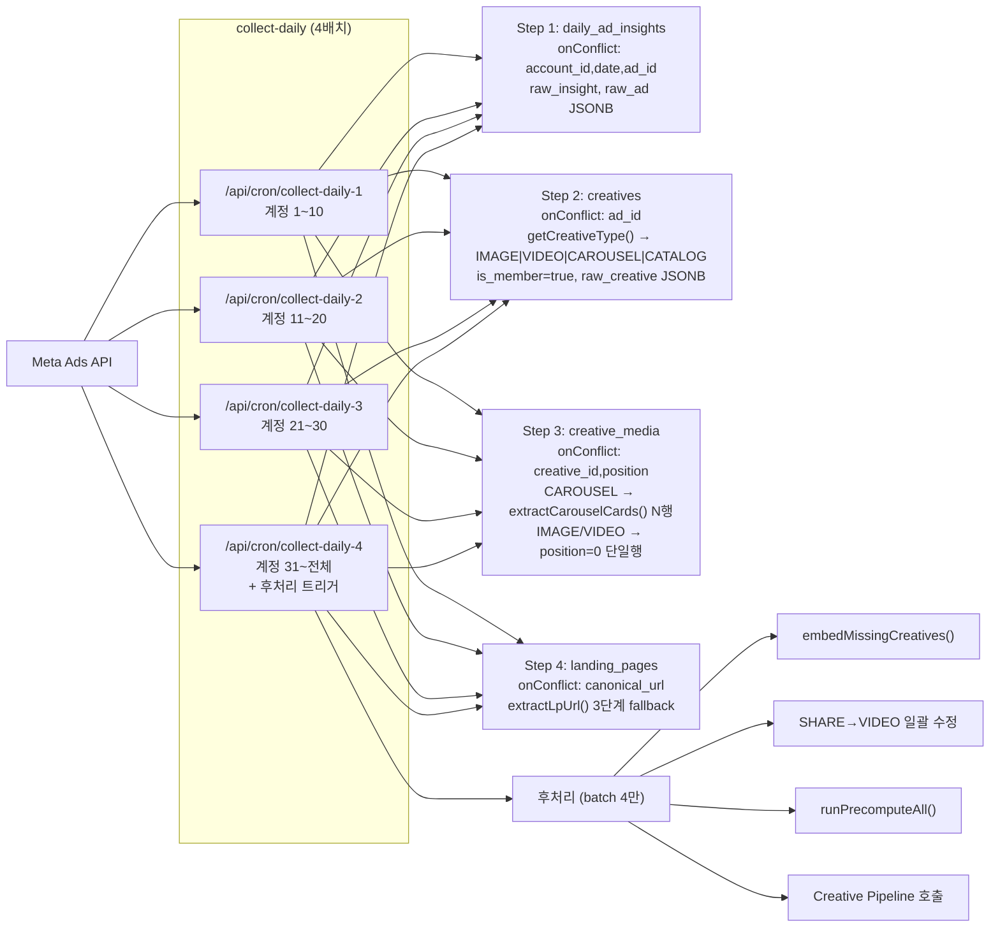
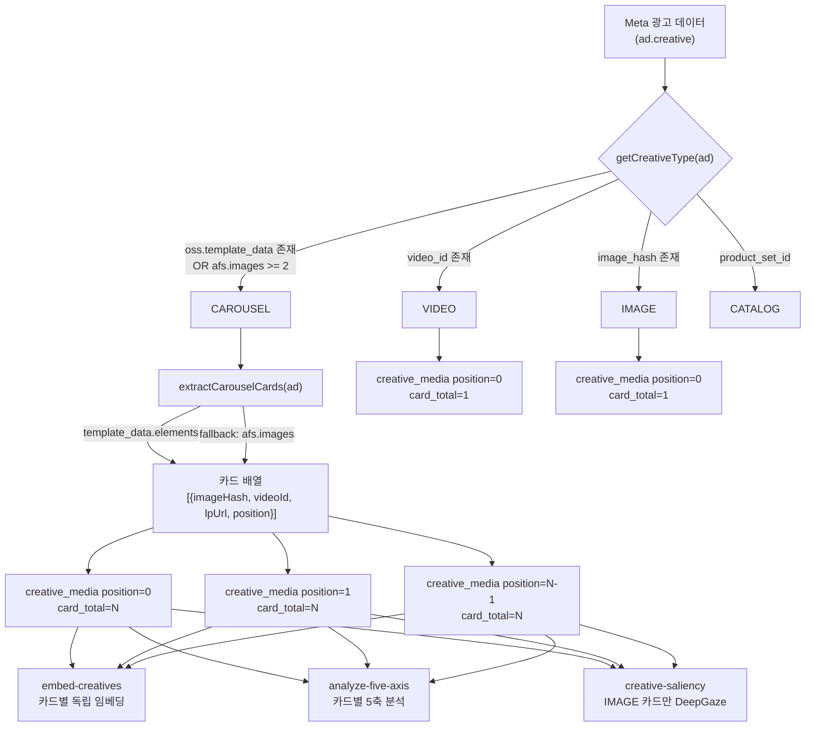
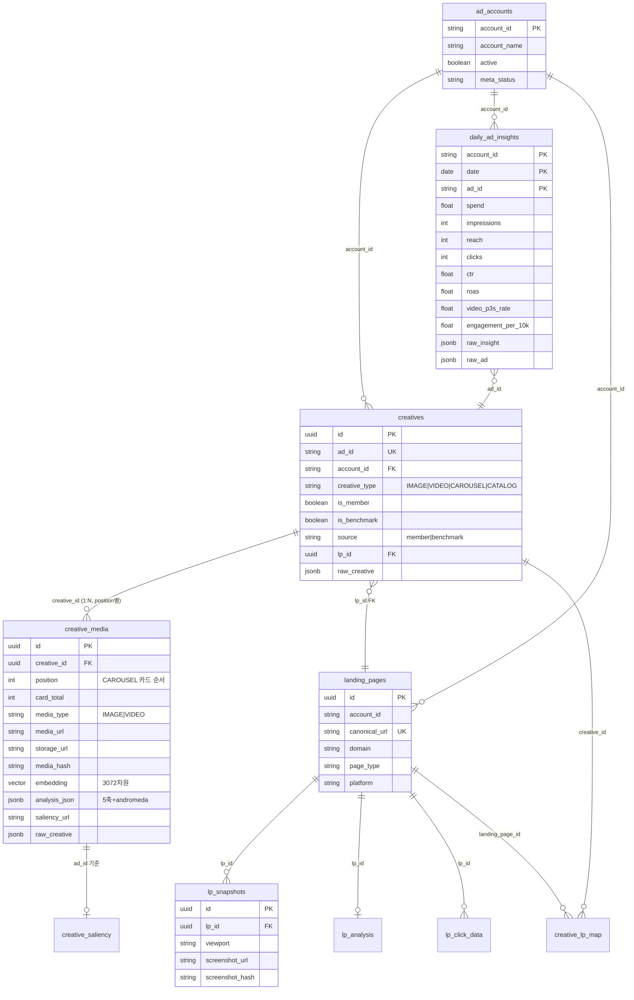
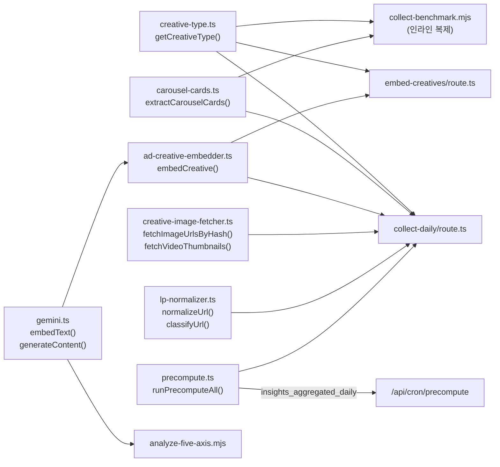

# 수집→저장→분석→서비스 전체 아키텍처

> 최종 갱신: 2026-03-24 | Wave 2-3 CAROUSEL 대응 반영

---

## 1. 전체 데이터 파이프라인

```mermaid
flowchart TB
    subgraph EXT["외부 데이터 소스"]
        META["Meta Graph API<br/>v21.0"]
        RAILWAY["GCP Cloud Run<br/>creative-pipeline<br/>(DeepGaze Python)"]
        GEMINI["Gemini 2.5 Pro<br/>임베딩 + 5축 분석"]
    end

    subgraph COLLECT["① 수집 입구"]
        CD["collect-daily<br/>/api/cron/collect-daily<br/>(batch 1~4, 매일 4회)"]
        CB["collect-benchmark<br/>scripts/collect-benchmark-creatives.mjs"]
        BF["backfill<br/>/api/admin/protractor/collect<br/>(mode=backfill, 90일)"]
        CC["competitor-check<br/>/api/cron/competitor-check<br/>(6시간 주기)"]
        CL["crawl-lps<br/>/api/cron/crawl-lps"]
        CK["collect-clicks<br/>/api/cron/collect-clicks"]
    end

    subgraph DB["② DB 저장 (raw JSONB + 정규화)"]
        DAI["daily_ad_insights<br/>PK: account_id, date, ad_id<br/>raw_insight JSONB, raw_ad JSONB<br/>spend, impressions, reach, ctr, roas<br/>video_p3s_rate, engagement_per_10k"]
        CR["creatives<br/>PK: id, UNIQUE: ad_id<br/>creative_type: IMAGE|VIDEO|CAROUSEL|CATALOG<br/>is_member, is_benchmark<br/>raw_creative JSONB, lp_id FK"]
        CM["creative_media<br/>PK: id, UNIQUE: creative_id+position<br/>media_type, media_url, storage_url<br/>position (CAROUSEL 카드), card_total<br/>embedding vector(3072)<br/>analysis_json JSONB, saliency_url"]
        LP["landing_pages<br/>PK: id, UNIQUE: canonical_url<br/>domain, page_type, platform<br/>is_active"]
        LPS["lp_snapshots<br/>FK: lp_id<br/>screenshot_url, cta_screenshot_url<br/>screenshot_hash, crawled_at"]
        AIC["ad_insights_classified<br/>벤치마크 기준 분류"]
        CAC["competitor_ad_cache<br/>carousel_cards JSONB"]
        LCD["lp_click_data<br/>FK: lp_id"]
    end

    subgraph PROCESS["③ 후처리 파이프라인"]
        EMB["embed-creatives<br/>/api/cron/embed-creatives<br/>Gemini 3072차원 임베딩<br/>CAROUSEL 카드별 독립"]
        FA["analyze-five-axis<br/>scripts/analyze-five-axis.mjs<br/>Cloud Run Job 01:00 KST<br/>visual/text/psychology/quality/hook"]
        DG["creative-saliency<br/>/api/cron/creative-saliency<br/>DeepGaze 시선 히트맵<br/>IMAGE 카드만 (VIDEO 스킵)"]
        AND["compute-andromeda<br/>scripts/compute-andromeda-similarity.mjs<br/>Cloud Run Job 03:00 KST<br/>4축 가중 Jaccard 유사도"]
        FR["compute-fatigue-risk<br/>scripts/compute-fatigue-risk.mjs<br/>Cloud Run Job 02:30 KST"]
        PC["precompute<br/>/api/cron/precompute<br/>insights_aggregated_daily"]
        LPA["analyze-lps<br/>scripts/analyze-lps-v2.mjs<br/>LP 2축 분석"]
        SP["compute-score-percentiles<br/>Cloud Run Job 02:00 KST"]
        CLA["analyze-creative-lp-alignment<br/>scripts/analyze-creative-lp-alignment.mjs<br/>Cloud Run Job 03:30 KST"]
    end

    subgraph API["④ API (서비스 레이어)"]
        AI["GET /api/protractor/insights<br/>광고 성과 조회"]
        AT["GET /api/protractor/total-value<br/>총가치각도기"]
        AB["GET /api/protractor/benchmarks<br/>벤치마크 비교"]
        AO["GET /api/protractor/overlap<br/>소재-LP 겹침 분석"]
        AC["GET /api/protractor/creatives<br/>소재 상세"]
        ACP["GET /api/protractor/competitor<br/>경쟁사 분석"]
        AAC["GET /api/protractor/accounts<br/>계정 목록"]
    end

    subgraph UI["⑤ 프론트엔드 (Next.js App Router)"]
        PD["protractor/page.tsx<br/>총가치각도기 대시보드"]
        PCR["protractor/creatives/page.tsx<br/>소재 분석 뷰"]
        PCP["protractor/competitor/page.tsx<br/>경쟁사 모니터링"]
        DD["dashboard/page.tsx<br/>역할별 대시보드<br/>(admin/member/student)"]
    end

    %% 수집 흐름
    META --> CD
    META --> CB
    META --> BF
    META --> CC
    CD --> DAI
    CD --> CR
    CD --> CM
    CD --> LP
    CB --> CR
    CB --> CM
    CB --> AIC
    BF --> |runCollectDaily 재사용| DAI
    CC --> CAC
    CL --> LPS
    CL --> LP
    CK --> LCD

    %% 후처리 흐름
    CM --> EMB
    GEMINI --> EMB
    EMB --> |embedding 3072| CM
    CM --> FA
    GEMINI --> FA
    FA --> |analysis_json| CM
    CM --> DG
    RAILWAY --> DG
    DG --> |saliency_url| CM
    CM --> AND
    AND --> |andromeda_signals| CM
    DAI --> FR
    DAI --> PC
    LP --> LPA
    LPS --> LPA
    CM --> SP
    CM --> CLA
    LP --> CLA

    %% API → DB
    DAI --> AI
    DAI --> AT
    AIC --> AB
    CM --> AC
    CM --> AO
    CAC --> ACP
    CR --> AAC

    %% UI → API
    AI --> PD
    AT --> PD
    AB --> PD
    AC --> PCR
    AO --> PCR
    ACP --> PCP
    AAC --> DD
    AI --> DD
```



---

## 2. 수집 입구 상세



---

## 3. CAROUSEL 데이터 흐름



---

## 4. DB 테이블 관계



---

## 5. Cloud Run Jobs 스케줄

```mermaid
gantt
    title 일일 파이프라인 실행 순서 (KST)
    dateFormat HH:mm
    axisFormat %H:%M

    section 수집
    collect-daily batch1~4       :cd, 03:00, 30min
    collect-benchmarks           :cb, 03:30, 15min
    collect-clicks               :ck, 04:00, 15min
    competitor-check             :cc, 00:00, 10min

    section 후처리
    embed-creatives              :em, 03:30, 30min
    analyze-five-axis            :fa, 01:00, 60min
    compute-score-percentiles    :sp, 02:00, 15min
    compute-fatigue-risk         :fr, 02:30, 15min
    compute-andromeda-similarity :an, 03:00, 30min
    analyze-lp-alignment         :la, 03:30, 15min
    analyze-lp-saliency          :ls, 04:00, 30min

    section 크롤링
    crawl-lps                    :cl, 05:00, 60min
```



---

## 6. Storage 경로 패턴 (ADR-001)

```
gs://bscamp-storage/
├── creatives/
│   └── {account_id}/
│       └── media/
│           ├── {ad_id}.jpg          ← 소재 이미지
│           └── {ad_id}.mp4          ← 소재 영상
├── lp/
│   └── {account_id}/
│       └── {lp_id}/
│           ├── mobile_full.jpg      ← LP 전체 스크린샷
│           ├── mobile_cta.jpg       ← LP CTA 영역
│           ├── page.html            ← LP HTML 원본
│           └── media/
│               └── {hash}.{ext}     ← LP 미디어 자산
└── saliency/
    └── {ad_id}_attention.png        ← DeepGaze 히트맵
```

---

## 7. 주요 라이브러리 의존성


